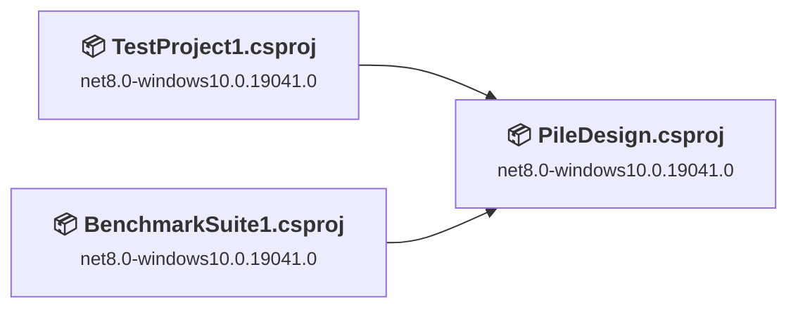
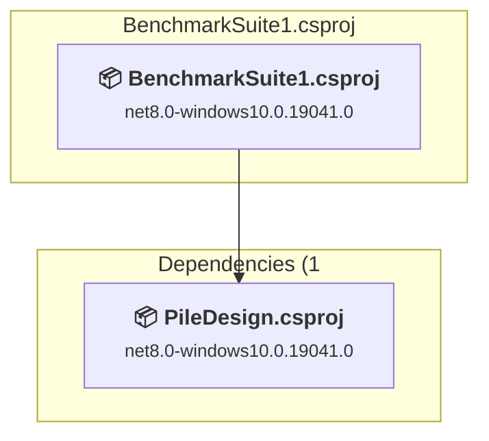
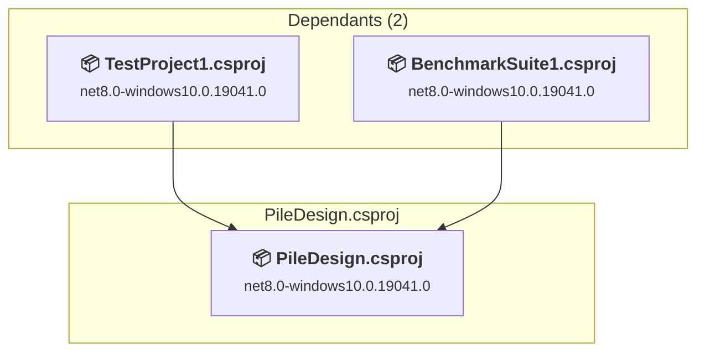
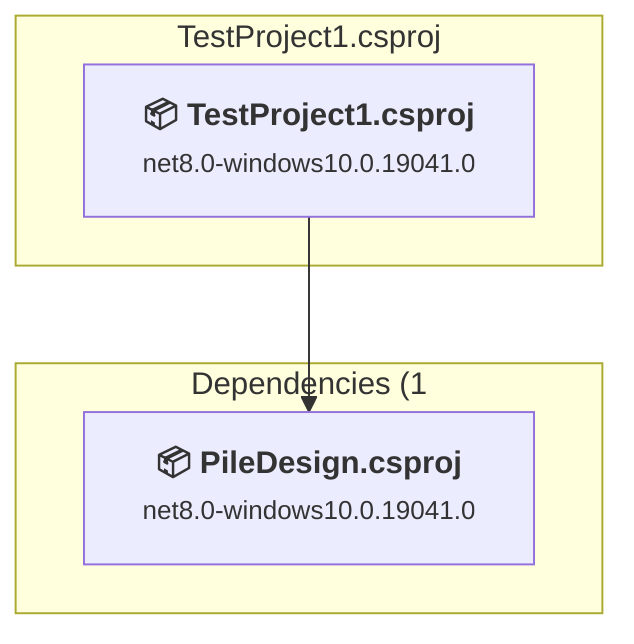

# Projects and dependencies analysis

This document provides a comprehensive overview of the projects and their dependencies in the context of upgrading to .NETCoreApp,Version=v10.0.

## Table of Contents

- [Executive Summary](#executive-Summary)
  - [Highlevel Metrics](#highlevel-metrics)
  - [Projects Compatibility](#projects-compatibility)
  - [Package Compatibility](#package-compatibility)
  - [API Compatibility](#api-compatibility)
  - [Binding Redirect Configuration](#binding-redirect-configuration)
- [Aggregate NuGet packages details](#aggregate-nuget-packages-details)
- [Top API Migration Challenges](#top-api-migration-challenges)
  - [Technologies and Features](#technologies-and-features)
  - [Most Frequent API Issues](#most-frequent-api-issues)
- [Projects Relationship Graph](#projects-relationship-graph)
- [Project Details](#project-details)

  - [BenchmarkSuite1\BenchmarkSuite1.csproj](#benchmarksuite1benchmarksuite1csproj)
  - [Graphics_r1\PileDesign.csproj](#graphics_r1piledesigncsproj)
  - [TestProject1\TestProject1.csproj](#testproject1testproject1csproj)

## Executive Summary

### Highlevel Metrics

| Metric | Count | Status |
| :--- | :---: | :--- |
| Total Projects | 3 | All require upgrade |
| Total NuGet Packages | 53 | 8 need upgrade |
| Total Code Files | 439 |  |
| Total Code Files with Incidents | 283 |  |
| Total Lines of Code | 164430 |  |
| Total Number of Issues | 29862 |  |
| Estimated LOC to modify | 29851+ | at least 18.2% of codebase |

### Projects Compatibility

| Project | Target Framework | Difficulty | Package Issues | API Issues | Binding Issues | Est. LOC Impact | Description |
| :--- | :---: | :---: | :---: | :---: | :---: | :---: | :--- |
| [BenchmarkSuite1\BenchmarkSuite1.csproj](#benchmarksuite1benchmarksuite1csproj) | net8.0-windows10.0.19041.0 | 🟡 Medium | 0 | 120 | 0 | 120+ | DotNetCoreApp, Sdk Style = True |
| [Graphics_r1\PileDesign.csproj](#graphics_r1piledesigncsproj) | net8.0-windows10.0.19041.0 | 🟡 Medium | 6 | 29332 | 0 | 29332+ | Wpf, Sdk Style = True |
| [TestProject1\TestProject1.csproj](#testproject1testproject1csproj) | net8.0-windows10.0.19041.0 | 🟡 Medium | 2 | 399 | 0 | 399+ | Wpf, Sdk Style = True |

### Package Compatibility

| Status | Count | Percentage |
| :--- | :---: | :---: |
| ✅ Compatible | 45 | 84.9% |
| ⚠️ Incompatible | 8 | 15.1% |
| 🔄 Upgrade Recommended | 0 | 0.0% |
| ***Total NuGet Packages*** | ***53*** | ***100%*** |

### API Compatibility

| Category | Count | Impact |
| :--- | :---: | :--- |
| 🔴 Binary Incompatible | 29696 | High - Require code changes |
| 🟡 Source Incompatible | 33 | Medium - Needs re-compilation and potential conflicting API error fixing |
| 🔵 Behavioral change | 122 | Low - Behavioral changes that may require testing at runtime |
| ✅ Compatible | 164462 |  |
| ***Total APIs Analyzed*** | ***194313*** |  |

## Aggregate NuGet packages details

| Package | Current Version | Suggested Version | Projects | Description |
| :--- | :---: | :---: | :--- | :--- |
| ACadSharp | 3.6.35 |  | [PileDesign.csproj](#graphics_r1piledesigncsproj) | ✅Compatible |
| BenchmarkDotNet | 0.15.8 |  | [BenchmarkSuite1.csproj](#benchmarksuite1benchmarksuite1csproj) | ✅Compatible |
| CommunityToolkit.Mvvm | 8.4.2 |  | [PileDesign.csproj](#graphics_r1piledesigncsproj) | ✅Compatible |
| coverlet.collector | 6.0.2 |  | [TestProject1.csproj](#testproject1testproject1csproj) | ✅Compatible |
| coverlet.msbuild | 6.0.2 |  | [TestProject1.csproj](#testproject1testproject1csproj) | ✅Compatible |
| CSparse | 4.4.0 |  | [PileDesign.csproj](#graphics_r1piledesigncsproj) | ✅Compatible |
| CsvHelper | 33.1.0 |  | [PileDesign.csproj](#graphics_r1piledesigncsproj) | ✅Compatible |
| Cyotek.Drawing.BitmapFont | 2.0.4 |  | [PileDesign.csproj](#graphics_r1piledesigncsproj) | ✅Compatible |
| Dirkster.AvalonDock | 4.74.1 |  | [PileDesign.csproj](#graphics_r1piledesigncsproj) | ✅Compatible |
| Dirkster.AvalonDock.Themes.VS2013 | 4.74.1 |  | [PileDesign.csproj](#graphics_r1piledesigncsproj) | ✅Compatible |
| DocumentFormat.OpenXml | 3.5.1 |  | [PileDesign.csproj](#graphics_r1piledesigncsproj) | ✅Compatible |
| DocumentFormat.OpenXml.Framework | 3.5.1 |  | [PileDesign.csproj](#graphics_r1piledesigncsproj) | ✅Compatible |
| Fluent.Ribbon | 11.0.2 | 10.1.0 | [PileDesign.csproj](#graphics_r1piledesigncsproj) | ⚠️NuGet パッケージに互換性がありません |
| FsCheck | 2.16.6 |  | [TestProject1.csproj](#testproject1testproject1csproj) | ✅Compatible |
| HarfBuzzSharp | 14.2.1.1 |  | [PileDesign.csproj](#graphics_r1piledesigncsproj) | ✅Compatible |
| HarfBuzzSharp.NativeAssets.macOS | 14.2.1.1 |  | [PileDesign.csproj](#graphics_r1piledesigncsproj) | ✅Compatible |
| HarfBuzzSharp.NativeAssets.Win32 | 14.2.1.1 |  | [PileDesign.csproj](#graphics_r1piledesigncsproj) | ✅Compatible |
| HelixToolkit | 3.1.2 |  | [PileDesign.csproj](#graphics_r1piledesigncsproj) | ✅Compatible |
| HelixToolkit.Geometry | 3.1.2 |  | [PileDesign.csproj](#graphics_r1piledesigncsproj) | ✅Compatible |
| HelixToolkit.Maths | 3.1.2 |  | [PileDesign.csproj](#graphics_r1piledesigncsproj) | ✅Compatible |
| HelixToolkit.Wpf | 3.1.2 |  | [PileDesign.csproj](#graphics_r1piledesigncsproj) | ⚠️NuGet パッケージに互換性がありません |
| MathNet.Numerics.Signed | 5.0.0 |  | [PileDesign.csproj](#graphics_r1piledesigncsproj) | ✅Compatible |
| Microsoft.Bcl.HashCode | 6.0.0 |  | [PileDesign.csproj](#graphics_r1piledesigncsproj) | ✅Compatible |
| Microsoft.CSharp | 4.7.0 |  | [PileDesign.csproj](#graphics_r1piledesigncsproj) | ✅Compatible |
| Microsoft.NET.Test.Sdk | 17.12.0 |  | [TestProject1.csproj](#testproject1testproject1csproj) | ✅Compatible |
| Microsoft.VisualStudio.DiagnosticsHub.BenchmarkDotNetDiagnosers | 18.3.36812.1 |  | [BenchmarkSuite1.csproj](#benchmarksuite1benchmarksuite1csproj) | ✅Compatible |
| Microsoft.Web.WebView2 | 1.0.4078.44 |  | [PileDesign.csproj](#graphics_r1piledesigncsproj) | ✅Compatible |
| Microsoft.Xaml.Behaviors.Wpf | 1.1.142 | 1.1.39 | [PileDesign.csproj](#graphics_r1piledesigncsproj) | ⚠️NuGet パッケージに互換性がありません |
| MSTest.TestAdapter | 3.6.3 |  | [TestProject1.csproj](#testproject1testproject1csproj) | ⚠️NuGet パッケージは非推奨です |
| MSTest.TestFramework | 3.6.3 |  | [TestProject1.csproj](#testproject1testproject1csproj) | ⚠️NuGet パッケージは非推奨です |
| Newtonsoft.Json | 13.0.4 |  | [PileDesign.csproj](#graphics_r1piledesigncsproj) | ✅Compatible |
| OpenTK | 5.0.0-pre.13 |  | [PileDesign.csproj](#graphics_r1piledesigncsproj) | ✅Compatible |
| OpenTK.GLWpfControl | 5.0.0-pre.1 | 4.3.6 | [PileDesign.csproj](#graphics_r1piledesigncsproj) | ⚠️NuGet パッケージに互換性がありません |
| Rhino3dm | 8.17.0 |  | [PileDesign.csproj](#graphics_r1piledesigncsproj) | ✅Compatible |
| ScottPlot | 5.1.59 |  | [PileDesign.csproj](#graphics_r1piledesigncsproj) | ✅Compatible |
| ScottPlot.WPF | 5.1.59 | 4.1.73 | [PileDesign.csproj](#graphics_r1piledesigncsproj) | ⚠️NuGet パッケージに互換性がありません |
| Serilog | 4.4.0 |  | [PileDesign.csproj](#graphics_r1piledesigncsproj) | ✅Compatible |
| Serilog.Sinks.Debug | 3.0.0 |  | [PileDesign.csproj](#graphics_r1piledesigncsproj) | ✅Compatible |
| Serilog.Sinks.File | 7.0.0 |  | [PileDesign.csproj](#graphics_r1piledesigncsproj) | ✅Compatible |
| SharpDX | 4.2.0 |  | [PileDesign.csproj](#graphics_r1piledesigncsproj) | ✅Compatible |
| SharpDX.D3DCompiler | 4.2.0 |  | [PileDesign.csproj](#graphics_r1piledesigncsproj) | ✅Compatible |
| SharpDX.Direct2D1 | 4.2.0 |  | [PileDesign.csproj](#graphics_r1piledesigncsproj) | ✅Compatible |
| SharpDX.Direct3D11 | 4.2.0 |  | [PileDesign.csproj](#graphics_r1piledesigncsproj) | ✅Compatible |
| SharpDX.Direct3D9 | 4.2.0 |  | [PileDesign.csproj](#graphics_r1piledesigncsproj) | ✅Compatible |
| SharpDX.DXGI | 4.2.0 |  | [PileDesign.csproj](#graphics_r1piledesigncsproj) | ✅Compatible |
| SharpDX.Mathematics | 4.2.0 |  | [PileDesign.csproj](#graphics_r1piledesigncsproj) | ✅Compatible |
| SharpVectors | 1.8.5 |  | [PileDesign.csproj](#graphics_r1piledesigncsproj) | ✅Compatible |
| SharpVectors.Wpf | 1.8.5 |  | [PileDesign.csproj](#graphics_r1piledesigncsproj) | ✅Compatible |
| SkiaSharp | 4.150.1 |  | [PileDesign.csproj](#graphics_r1piledesigncsproj) | ✅Compatible |
| Svg.Skia | 5.1.1 |  | [PileDesign.csproj](#graphics_r1piledesigncsproj) | ✅Compatible |
| System.Linq.Async | 7.0.1 |  | [PileDesign.csproj](#graphics_r1piledesigncsproj) | ✅Compatible |
| System.Runtime.CompilerServices.Unsafe | 6.1.2 |  | [PileDesign.csproj](#graphics_r1piledesigncsproj) | ✅Compatible |
| WpfMath | 2.1.0 | 0.13.1 | [PileDesign.csproj](#graphics_r1piledesigncsproj) | ⚠️NuGet パッケージに互換性がありません |

## Top API Migration Challenges

### Technologies and Features

| Technology | Issues | Percentage | Migration Path |
| :--- | :---: | :---: | :--- |
| WPF (Windows Presentation Foundation) | 19377 | 64.9% | WPF APIs for building Windows desktop applications with XAML-based UI that are available in .NET on Windows. WPF provides rich desktop UI capabilities with data binding and styling. Enable Windows Desktop support: Option 1 (Recommended): Target net9.0-windows; Option 2: Add <UseWindowsDesktop>true</UseWindowsDesktop>. |
| Legacy Configuration System | 8 | 0.0% | Legacy XML-based configuration system (app.config/web.config) that has been replaced by a more flexible configuration model in .NET Core. The old system was rigid and XML-based. Migrate to Microsoft.Extensions.Configuration with JSON/environment variables; use System.Configuration.ConfigurationManager NuGet package as interim bridge if needed. |

### Most Frequent API Issues

| API | Count | Percentage | Category |
| :--- | :---: | :---: | :--- |
| T:System.Windows.Point | 1245 | 4.2% | Binary Incompatible |
| T:System.Windows.Media.Media3D.Point3D | 1177 | 3.9% | Binary Incompatible |
| T:System.Windows.RoutedEventHandler | 706 | 2.4% | Binary Incompatible |
| T:System.Windows.Controls.Canvas | 616 | 2.1% | Binary Incompatible |
| T:System.Windows.Media.PathGeometry | 579 | 1.9% | Binary Incompatible |
| T:System.Windows.Media.SolidColorBrush | 567 | 1.9% | Binary Incompatible |
| T:System.Windows.Input.Key | 494 | 1.7% | Binary Incompatible |
| P:System.Windows.Point.X | 484 | 1.6% | Binary Incompatible |
| T:System.Windows.MessageBoxImage | 483 | 1.6% | Binary Incompatible |
| T:System.Windows.MessageBoxButton | 472 | 1.6% | Binary Incompatible |
| M:System.Windows.Media.Media3D.Point3D.#ctor(System.Double,System.Double,System.Double) | 468 | 1.6% | Binary Incompatible |
| P:System.Windows.Point.Y | 464 | 1.6% | Binary Incompatible |
| T:System.Windows.Controls.TextBox | 450 | 1.5% | Binary Incompatible |
| P:System.Windows.FrameworkElement.DataContext | 423 | 1.4% | Binary Incompatible |
| T:System.Windows.MessageBoxResult | 415 | 1.4% | Binary Incompatible |
| M:System.Windows.Point.#ctor(System.Double,System.Double) | 410 | 1.4% | Binary Incompatible |
| T:System.Windows.Media.Brush | 393 | 1.3% | Binary Incompatible |
| T:System.Windows.Input.MouseButtonEventHandler | 330 | 1.1% | Binary Incompatible |
| T:System.Windows.Media.Brushes | 312 | 1.0% | Binary Incompatible |
| T:System.Windows.Media.Color | 292 | 1.0% | Binary Incompatible |
| T:System.Windows.Input.KeyEventHandler | 280 | 0.9% | Binary Incompatible |
| T:System.Windows.Input.ModifierKeys | 266 | 0.9% | Binary Incompatible |
| P:System.Windows.Media.Media3D.Point3D.Y | 265 | 0.9% | Binary Incompatible |
| P:System.Windows.Media.Media3D.Point3D.X | 265 | 0.9% | Binary Incompatible |
| T:System.Windows.Controls.UIElementCollection | 248 | 0.8% | Binary Incompatible |
| P:System.Windows.Controls.Panel.Children | 248 | 0.8% | Binary Incompatible |
| T:System.Windows.Controls.ComboBox | 235 | 0.8% | Binary Incompatible |
| T:System.Windows.Application | 222 | 0.7% | Binary Incompatible |
| P:System.Windows.Media.Media3D.Point3D.Z | 215 | 0.7% | Binary Incompatible |
| T:System.Windows.Controls.Button | 210 | 0.7% | Binary Incompatible |
| T:System.Windows.RoutedEventArgs | 190 | 0.6% | Binary Incompatible |
| M:System.Windows.Controls.UIElementCollection.Add(System.Windows.UIElement) | 190 | 0.6% | Binary Incompatible |
| T:System.Windows.Controls.TextBlock | 189 | 0.6% | Binary Incompatible |
| M:System.Windows.Media.PathGeometry.AddGeometry(System.Windows.Media.Geometry) | 185 | 0.6% | Binary Incompatible |
| F:System.Windows.MessageBoxButton.OK | 184 | 0.6% | Binary Incompatible |
| T:System.Windows.Visibility | 179 | 0.6% | Binary Incompatible |
| T:System.Windows.Media.Media3D.Vector3D | 167 | 0.6% | Binary Incompatible |
| T:System.Windows.Window | 157 | 0.5% | Binary Incompatible |
| P:System.Windows.Shapes.Shape.Stroke | 151 | 0.5% | Binary Incompatible |
| P:System.Windows.Shapes.Shape.StrokeThickness | 145 | 0.5% | Binary Incompatible |
| T:System.Windows.Controls.TextChangedEventHandler | 140 | 0.5% | Binary Incompatible |
| E:System.Windows.UIElement.PreviewMouseLeftButtonDown | 133 | 0.4% | Binary Incompatible |
| T:System.Windows.Controls.SelectionChangedEventHandler | 130 | 0.4% | Binary Incompatible |
| T:System.Windows.Threading.DispatcherTimer | 124 | 0.4% | Binary Incompatible |
| P:System.Windows.RoutedEventArgs.Handled | 121 | 0.4% | Binary Incompatible |
| P:System.Windows.Input.KeyEventArgs.Key | 117 | 0.4% | Binary Incompatible |
| T:System.Windows.Threading.Dispatcher | 116 | 0.4% | Binary Incompatible |
| T:System.Windows.Media.Geometry | 116 | 0.4% | Binary Incompatible |
| P:System.Windows.Shapes.Path.Data | 113 | 0.4% | Binary Incompatible |
| T:System.Windows.Shapes.Path | 113 | 0.4% | Binary Incompatible |

## Projects Relationship Graph

Legend:
📦 SDK-style project
⚙️ Classic project

## Project Details

### BenchmarkSuite1\BenchmarkSuite1.csproj

#### Project Info

- **Current Target Framework:** net8.0-windows10.0.19041.0
- **Proposed Target Framework:** net10.0--windows10.0.19041.0
- **SDK-style**: True
- **Project Kind:** DotNetCoreApp
- **Dependencies**: 1
- **Dependants**: 0
- **Number of Files**: 6
- **Number of Files with Incidents**: 2
- **Lines of Code**: 378
- **Estimated LOC to modify**: 120+ (at least 31.7% of the project)

#### Dependency Graph

Legend:
📦 SDK-style project
⚙️ Classic project

### API Compatibility

| Category | Count | Impact |
| :--- | :---: | :--- |
| 🔴 Binary Incompatible | 120 | High - Require code changes |
| 🟡 Source Incompatible | 0 | Medium - Needs re-compilation and potential conflicting API error fixing |
| 🔵 Behavioral change | 0 | Low - Behavioral changes that may require testing at runtime |
| ✅ Compatible | 526 |  |
| ***Total APIs Analyzed*** | ***646*** |  |

#### Project Technologies and Features

| Technology | Issues | Percentage | Migration Path |
| :--- | :---: | :---: | :--- |
| WPF (Windows Presentation Foundation) | 66 | 55.0% | WPF APIs for building Windows desktop applications with XAML-based UI that are available in .NET on Windows. WPF provides rich desktop UI capabilities with data binding and styling. Enable Windows Desktop support: Option 1 (Recommended): Target net9.0-windows; Option 2: Add <UseWindowsDesktop>true</UseWindowsDesktop>. |

### Graphics_r1\PileDesign.csproj

#### Project Info

- **Current Target Framework:** net8.0-windows10.0.19041.0
- **Proposed Target Framework:** net10.0-windows
- **SDK-style**: True
- **Project Kind:** Wpf
- **Dependencies**: 0
- **Dependants**: 2
- **Number of Files**: 939
- **Number of Files with Incidents**: 268
- **Lines of Code**: 148226
- **Estimated LOC to modify**: 29332+ (at least 19.8% of the project)

#### Dependency Graph

Legend:
📦 SDK-style project
⚙️ Classic project

### API Compatibility

| Category | Count | Impact |
| :--- | :---: | :--- |
| 🔴 Binary Incompatible | 29179 | High - Require code changes |
| 🟡 Source Incompatible | 33 | Medium - Needs re-compilation and potential conflicting API error fixing |
| 🔵 Behavioral change | 120 | Low - Behavioral changes that may require testing at runtime |
| ✅ Compatible | 145874 |  |
| ***Total APIs Analyzed*** | ***175206*** |  |

#### Project Technologies and Features

| Technology | Issues | Percentage | Migration Path |
| :--- | :---: | :---: | :--- |
| Legacy Configuration System | 8 | 0.0% | Legacy XML-based configuration system (app.config/web.config) that has been replaced by a more flexible configuration model in .NET Core. The old system was rigid and XML-based. Migrate to Microsoft.Extensions.Configuration with JSON/environment variables; use System.Configuration.ConfigurationManager NuGet package as interim bridge if needed. |
| WPF (Windows Presentation Foundation) | 18952 | 64.6% | WPF APIs for building Windows desktop applications with XAML-based UI that are available in .NET on Windows. WPF provides rich desktop UI capabilities with data binding and styling. Enable Windows Desktop support: Option 1 (Recommended): Target net9.0-windows; Option 2: Add <UseWindowsDesktop>true</UseWindowsDesktop>. |

### TestProject1\TestProject1.csproj

#### Project Info

- **Current Target Framework:** net8.0-windows10.0.19041.0
- **Proposed Target Framework:** net10.0-windows
- **SDK-style**: True
- **Project Kind:** Wpf
- **Dependencies**: 1
- **Dependants**: 0
- **Number of Files**: 55
- **Number of Files with Incidents**: 13
- **Lines of Code**: 15826
- **Estimated LOC to modify**: 399+ (at least 2.5% of the project)

#### Dependency Graph

Legend:
📦 SDK-style project
⚙️ Classic project

### API Compatibility

| Category | Count | Impact |
| :--- | :---: | :--- |
| 🔴 Binary Incompatible | 397 | High - Require code changes |
| 🟡 Source Incompatible | 0 | Medium - Needs re-compilation and potential conflicting API error fixing |
| 🔵 Behavioral change | 2 | Low - Behavioral changes that may require testing at runtime |
| ✅ Compatible | 18062 |  |
| ***Total APIs Analyzed*** | ***18461*** |  |

#### Project Technologies and Features

| Technology | Issues | Percentage | Migration Path |
| :--- | :---: | :---: | :--- |
| WPF (Windows Presentation Foundation) | 359 | 90.0% | WPF APIs for building Windows desktop applications with XAML-based UI that are available in .NET on Windows. WPF provides rich desktop UI capabilities with data binding and styling. Enable Windows Desktop support: Option 1 (Recommended): Target net9.0-windows; Option 2: Add <UseWindowsDesktop>true</UseWindowsDesktop>. |

