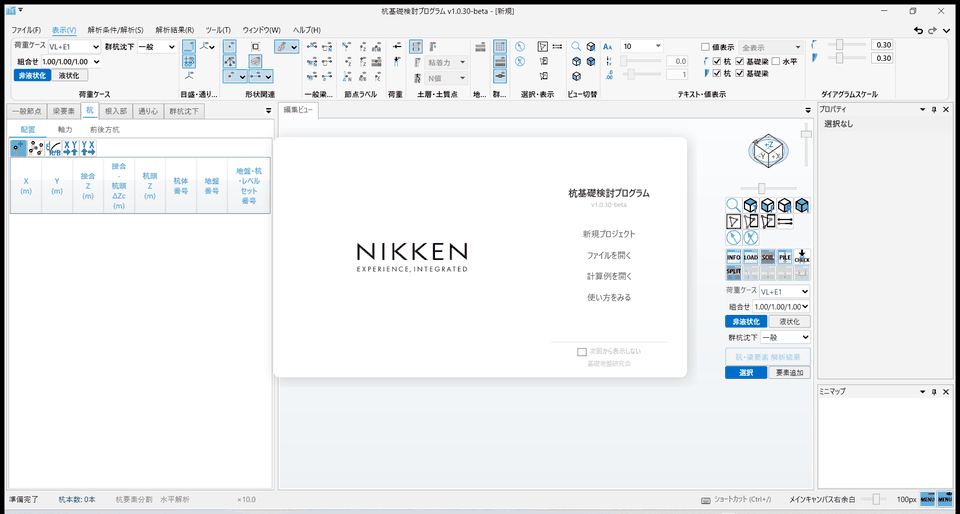
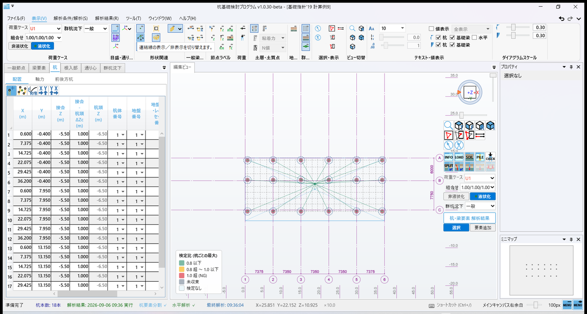
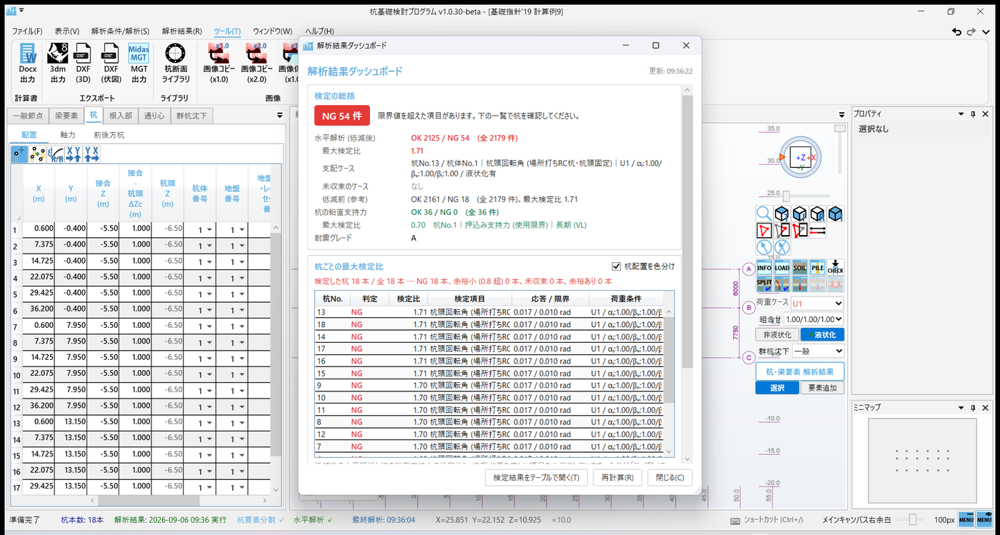
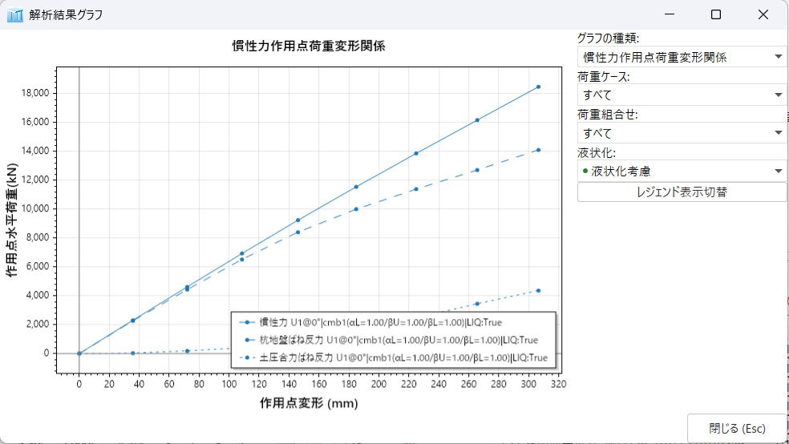
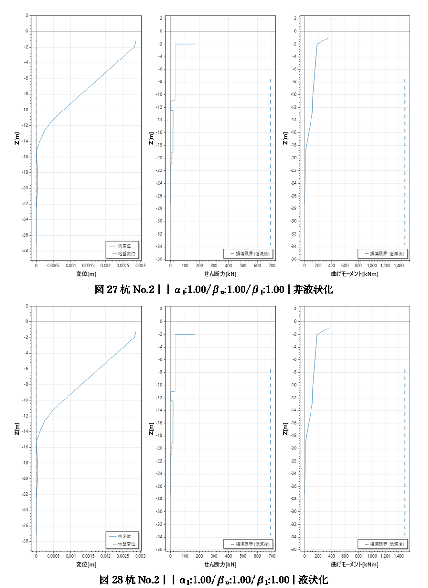

# 杭基礎検討プログラム (PileDesign)

杭基礎の水平抵抗・鉛直支持力・沈下を検討する WPF デスクトップアプリケーションです。
建築基礎構造設計指針および告示に基づく検討と、計算書 (Word) の出力を行います。

- .NET 8 / C# / WPF
- 現在 β 版です。重要な計算書としての使用は想定していません。

## 画面

例題を読み込み、杭要素分割 → 水平解析 → 検定 と進む流れです (基礎指針'19 計算例9、約 1 分の操作)。



| 杭配置の検定比色分け | 解析結果ダッシュボード |
|---|---|
|  |  |
| 平面図の杭頭を、杭ごとの最大検定比で 緑 / 黄 / 赤 / 灰 に塗ります | 判定バッジ・支配ケース・杭ごとの一覧を 1 画面にまとめます |

| 解析結果グラフ | 計算書 (Word) |
|---|---|
|  |  |
| 荷重変形関係、杭の変位・応力、沈下曲線などを荷重ケース・組合せで絞り込めます | 入力諸元・地盤・解析結果・検定を目次付きの docx に書き出します |

---

## リポジトリの構成

| プロジェクト | 役割 |
|---|---|
| `Graphics_r1/` (`PileDesign.csproj`) | 本体。UI・モデル・FEM・出力のすべて |
| `TestProject1/` | 単体・回帰テスト (MSTest) |
| `BenchmarkSuite1/` | 性能計測 |

`Graphics_r1` の中は次の並びです。

| フォルダ | 中身 |
|---|---|
| `Views/` | 画面 (XAML + code-behind)。`Views/Controls/` は共通部品 |
| `ViewModels/` | 画面のロジック。`MainWindowViewModel` は 12 ファイルの partial |
| `Models/` | 入力データ (`Models/InputData/`)・結果行 (`Models/Results/`)・杭断面 |
| `FEM/` | 解析。剛性行列の組立、Newton-Raphson、要素・ばね |
| `Services/` | 画面に属さない処理 (ファイル入出力、沈下解析、メッセージ) |
| `Output/` | 計算書 (Word)・DXF・3dm・MGT の書き出し |
| `Common/` | 汎用部品 (DataGrid 拡張、Undo、数値入力、ログ) |
| `Help/help.html` | ヘルプ本体 (1 ファイル、約 14,700 行) |
| `Examples/` | 計算例のプロジェクトファイル |

---

## 全体の流れ

```
入力モデル (InputModel)
    │  杭配置・杭体・地盤・荷重条件・基本設定
    ▼
杭要素分割 (ElementDivision)          ← ここまでが「入力」
    │  杭を解析用の要素に分け、地盤ばねを割り当てる
    ▼
FEM モデル (AnaModel)
    │  節点・梁要素・ばね・拘束を組み立てる
    ▼
解析 (水平 / 沈下)                    ← ここから先が「結果」
    │  荷重ステップごとに Newton-Raphson
    ▼
結果表示 (キャンバス / グラフ / テーブル) ・ 計算書出力
```

`IsElementSplit` が「杭要素分割が済んでいるか」を表します。水平解析・沈下解析は
これを前提にしているため、各コマンドの `CanExecute` で判定しています。

---

## 暗黙の前提 (踏み抜きやすい所)

ここに挙げたものは、いずれも**動いているコードを読んでも前提が分からず**、
実際に不具合になったものです。触る前に目を通してください。

### 1. 保存グラフに入る型の制約

保存は `System.Text.Json` + `ReferenceHandler.Preserve` (`$id` / `$ref`) です。
この形式には次の制約があります。

- **get のみのプロパティ**は書き出されるが復元されない。その結果 `$id` が登録されず、
  後から来る `$ref` が解決できなくなり、**保存ファイルが一切開けなくなる**。
- **引数付きコンストラクタで受ける値**に `$ref` は渡せない
  (`Reference metadata is not supported when deserializing constructor parameters`)。
  保存グラフに入る型には引数なしコンストラクタと set 可能なプロパティを用意すること。
- **`[JsonIgnore]` を付けたオブジェクト参照は復元されない**。
  参照を張り直すのは読み込み側の責任です (`RelinkPileFemAssociations` など)。
- **重い computed property には必ず `[JsonIgnore]`**。
  シリアライザは getter を全部呼ぶため、付け忘れると保存が桁違いに遅くなります。

### 2. 解析結果と入力の関係

- 解析結果は `AnalysisResultSet` として、**解析時の入力ごとスナップショット**で保持します。
  結果を見ながら入力を変更できるのはこのためです。
- **群杭沈下の結果は `GroupSettlementResult` が持ちます**。実体は 1 つで、現在の入力と
  スナップショットの `PileGroupSettlement.Result` が<b>同じインスタンス</b>を指します
  ([JsonIgnore] なので JSON 往復では複製されません)。保存はファイルの
  `GroupSettlementResult` の節で、**入力の中には書き出しません**。
  読込は `LegacySettlementMigration.AttachResultAndMigrate` が結び付けます
  (旧ファイルは入力側の `"CaseRecords"` に入っているので、そこから移します)。
  - `PileGroupSettlement.SettlementGridData` と `PileLayoutDataItem.GroupPileSettlement` は
    旧ファイル互換のための複製で、**結果を書かないこと**。読むのも移行処理だけです。
  - 単杭沈下の結果 (`SoilPile.LoadDisplacements`) は**まだ入力モデルの中**にあります。
- `IsElementSplit` は保存されないため、読み込み時に FEM モデルの有無から復元します。

### 3. 杭軸力は解析中に動く

M-φ (曲げモーメント-曲率) に使う軸力は **常時軸力 VL に固定ではありません**。
`SetVectorDF` が `AxialForceIncrement = (N_seis − VL) / nStep` を用意し、
`UpdateF` が荷重ステップごとに足していく**ランプ**です。
「VL 固定」と読み違えると、限界値の算定を丸ごと誤ります。

### 4. 並列に集めた寄与は加算順を固定する

全体剛性行列の組立を並列化する際、加算順が変わると浮動小数の丸めが変わり、
非線形 Newton-Raphson の分岐が反転して**反復数が倍・結果が数 % 動く**ことがあります。
`Parallel.ForEach` + `ConcurrentBag` ではなく、**固定長のインデックス分割**で
決定的な順序を保ってください。決定性のテストに許容差を置かないこと。

### 5. IsVisible は表示専用

`IsVisible` は描画の可否だけを表します。解析・FEM のコードは
**表示状態にかかわらず全項目を対象にする**こと。

### 6. 収束判定の「残差」は水平と沈下で意味が違う

同じ「残差が許容値以下」でも、比の取り方が違います。

| | 残差の定義 | 既定の許容値 | 力の比に直すと |
|---|---|---|---|
| 水平解析 | `‖R‖² / ‖F‖²` (**二乗**の比) | `1e-6` | `1e-3` |
| 沈下解析 | `‖R‖ / ‖F‖` (二乗しない) | `1e-8` | `1e-8` |

水平解析の `1e-6` を「力が 100 万分の 1」と読むと**桁を 3 つ読み違えます**。
どちらかに揃えると全モデルの結果が動くので、揃えるなら影響範囲を出してから。

---

### 7. 既製杭のプレストレスひずみは断面積分側だけが足す

`PHCSection` / `PRCSection` の断面積分 (`GetUltimateForceAndMoment` 等) は、断面ひずみ
ε0 に材料ごとの `Prestrains[…]` を足して材料の全ひずみにしてから `GetStress` を呼びます。
降伏・圧壊の状態定義 (`… − Prestrains[1]`) と限界ひずみ (`… − Prestrain`) もこの規約で
書かれています。**材料側 (`PrecastConcrete` / `Tendons` / `MainBars` の `GetStress`) は
プレストレスを足してはいけません。** 2026-09-07 まで両側で足しており、断面ひずみ 0 で
コンクリートが 2σe・PC 鋼材が降伏域・N ≠ 0 という状態から積分が始まっていました。
`SectionInvariantTests` (材料の σ(0)=0・零ひずみで N≈0) が全断面タイプで見張っています。

同じファイルの `Ftd` / `Fts` は「引張＝負」で持つので、引張強度の絶対値が要る式は
`−Ftd` です (ひび割れモーメント `Ze·(−Ftd + σe + σ0)`)。

## メッセージの書き方

`MessageService.Show(...)` で出す文は「**現象 + 理由 + 対処**」の 3 点で書きます。

- 何ができなかったか
- なぜか (足りない前提)
- どこで何をすれば直るか — **画面名とボタン名を具体的に**

守ること:

- 内部の識別子 (`PileLayoutItems`、`IsAnalysisTarget`、クラス名) を出さない。
  読んでも次の操作が決まりません。
- 例外を画面に出すときは `MessageService.ShowError(要約, ex)` を使います。
  Serilog に残したうえで、画面には要約・例外の文言・ログの場所を出します。
  例外オブジェクト (`{ex}`) をそのまま出してはいけません。
- 同じ状況の文は `Services/GuardMessages.cs` に集約する。
- β 版であることを踏まえ、**不必要に不安にさせる文言を足さない**。

「押したら叱られる」より「押す前に分かる」を優先します。前提を要する操作は
`[RelayCommand(CanExecute = ...)]` で無効にし、**理由をボタンのツールチップに出す**
(`ToolTipService.ShowOnDisabled="True"` が要ります)。

---

## 用語

同じ機能を別の名前で呼ばないこと。`TestProject1/TerminologyTests.cs` が検査します。

| 機能 | 呼び名 |
|---|---|
| F6 | 単杭沈下解析 |
| F7 | 単杭沈下解析（基礎梁考慮） |
| F8 | 群杭沈下解析（一般） |
| — | 群杭沈下解析（基礎梁考慮・反復） |
| 絞り込みなしの選択肢 | 「すべて」(`Common/UiText.All`) |
| 荷重組合せ係数 | αL / βU / βL (`Alpha1` / `Beta1` / `Beta2`) |

- 「SPRC」は利用者向けには使わず「場所打ち鋼管コンクリート杭」と書きます。
- UI ラベルは肯定形で統一します (「○○非表示」ではなく「○○表示」+ 既定 ON)。
- 「標高」は地盤 / 基本条件 / 杭先端 でのみ使い、他は Z 基準です。

手順の説明はヘルプの「クイックスタートガイド」の Step 1〜8 が正です。
リボンのツールチップとクイックヒントはそれに合わせます。

---

## ビルドとテスト

```
dotnet build TestProject1/TestProject1.csproj
dotnet test  TestProject1/TestProject1.csproj --no-build
```

注意:

- **アプリを起動したままだとビルドが失敗します** (`MSB3021`: exe をロック)。
  これは `error CS` を grep しても引っかからないので、ビルド結果は
  「`0 エラー`」の行で確認してください。
- 警告は `TreatWarningsAsErrors` + `WarningsNotAsErrors` の運用です。
  既存の警告種別は許容、新しい種別は即エラーになります。
- XAML の `StaticResource` のキー誤りは**ビルドを通り、開いた瞬間に例外**になります。
  ウィンドウを触ったら `*XamlSmokeTests` に追加してください
  (STA スレッド + App リソースの手動マージが要ります)。

---

## 文献との検証

<!-- verification-table:begin (自動生成: VerificationTableTests が書く。手で編集しない) -->
文献に数値として書かれている **45 項目**を計算し、**45 項目**が文献の許容内です（`TestProject1/LiteratureVerification/LiteratureCatalog.cs` が出典と値を持ち、`VerificationTableTests` が照合してこの表を書き出します）。

### 学会の指針・計算例 (6 / 6 項目)

| 出典 | 箇所 | 項目 | 文献値 | プログラム値 | 差 | 許容 | 判定 |
|---|---|---|---:|---:|---:|---|---|
| 建築基礎構造設計指針 2019 | 計算例2 例表2.2 | 地表面の地盤変位 (レベル2) | 127.4 mm | 126.8 mm | -0.5% | ±1.5% | 一致 |
| 建築基礎構造設計指針 2019 | 計算例1 例表1.2 | 繰返しせん断ひずみ γcy (GL-3.0 m, レベル1) | 4 % | 4 % | 0.0% | 倍半分 | 一致 |
| 建築基礎構造設計指針 2019 | 計算例1 例表1.2 | 繰返しせん断ひずみ γcy (GL-4.0 m, レベル1) | 8 % | 8 % | 0.0% | 倍半分 | 一致 |
| 建築基礎構造設計指針 2019 | 計算例1 例表1.2 | 繰返しせん断ひずみ γcy (GL-5.0 m, レベル1) | 1 % | 0.5 % | -50.0% | 倍半分 | 一致 |
| 建築基礎構造設計指針 2019 | 計算例1 例表1.2 | 繰返しせん断ひずみ γcy (GL-6.0 m, レベル1) | 2 % | 2 % | 0.0% | 倍半分 | 一致 |
| 建築基礎構造設計指針 2019 | 計算例1 例表1.2 | 繰返しせん断ひずみ γcy (GL-7.0 m, レベル1) | 0.5 % | 0.5 % | 0.0% | 倍半分 | 一致 |

### 認定工法のカタログ (39 / 39 項目)

杭先端の支持力算定を、メーカーが評定・認定の範囲で公表している算定式・対比表と照合したものです。学会の指針の再現とは性格が違うので、検証ウィンドウでも別ページにしています。

| 出典 | 箇所 | 項目 | 文献値 | プログラム値 | 差 | 許容 | 判定 |
|---|---|---|---:|---:|---:|---|---|
| Smart-MAGNUM 工法カタログ (ジャパンパイル) | p.10 先端支持力係数 α 対比表 | α (ωp=1.04, LL=0.5 m, 砂質・礫質) | 348 | 348 (348.14) | 0.0% | 切り捨て一致 | 一致 |
| Smart-MAGNUM 工法カタログ (ジャパンパイル) | p.10 先端支持力係数 α 対比表 | α (ωp=1.04, LL=1.0 m, 砂質・礫質) | 394 | 394 (394.94) | +0.2% | 切り捨て一致 | 一致 |
| Smart-MAGNUM 工法カタログ (ジャパンパイル) | p.10 先端支持力係数 α 対比表 | α (ωp=1.04, LL=2.0 m, 砂質・礫質) | 441 | 441 (441.74) | +0.2% | 切り捨て一致 | 一致 |
| Smart-MAGNUM 工法カタログ (ジャパンパイル) | p.10 先端支持力係数 α 対比表 | α (ωp=1.28, LL=0.5 m, 砂質・礫質) | 462 | 462 (462.76) | +0.2% | 切り捨て一致 | 一致 |
| Smart-MAGNUM 工法カタログ (ジャパンパイル) | p.10 先端支持力係数 α 対比表 | α (ωp=1.60, LL=0.5 m, 砂質・礫質) | 629 | 629 (629.73) | +0.1% | 切り捨て一致 | 一致 |
| Smart-MAGNUM 工法カタログ (ジャパンパイル) | p.10 先端支持力係数 α 対比表 | α (ωp=1.60, LL=1.0 m, 砂質・礫質) | 701 | 701 (701.73) | +0.1% | 切り捨て一致 | 一致 |
| Smart-MAGNUM 工法カタログ (ジャパンパイル) | p.10 先端支持力係数 α 対比表 | α (ωp=1.60, LL=2.0 m, 砂質・礫質) | 773 | 773 (773.73) | +0.1% | 切り捨て一致 | 一致 |
| Smart-MAGNUM 工法カタログ (ジャパンパイル) | p.10 先端支持力係数 α 対比表 | α (ωp=1.00, LL=0.5 m, 砂質・礫質) | 330 | 330 (330.00) | 0.0% | 切り捨て一致 | 一致 |
| Smart-MAGNUM 工法カタログ (ジャパンパイル) | p.10 先端支持力係数 α 対比表 | α (ωp=2.00, LL=2.0 m, 砂質・礫質) | 1,038 | 1,038 (1038.82) | +0.1% | 切り捨て一致 | 一致 |
| Smart-MAGNUM 工法カタログ (ジャパンパイル) | p.10 先端支持力係数 α 対比表 | α (ωp=1.04, LL=0.5 m, 粘土質) | 314 | 314 (314.15) | 0.0% | 切り捨て一致 | 一致 |
| Smart-MAGNUM 工法カタログ (ジャパンパイル) | p.10 先端支持力係数 α 対比表 | α (ωp=1.28, LL=0.5 m, 粘土質) | 401 | 401 (401.11) | 0.0% | 切り捨て一致 | 一致 |
| Smart-MAGNUM 工法カタログ (ジャパンパイル) | p.10 先端支持力係数 α 対比表 | α (ωp=1.76, LL=0.5 m, 粘土質) | 584 | 584 (584.11) | 0.0% | 切り捨て一致 | 一致 |
| Smart-MAGNUM 工法カタログ (ジャパンパイル) | p.10 先端支持力係数 α 対比表 | α (ωp=1.76, LL=2.0 m, 粘土質) | 742 | 742 (742.51) | +0.1% | 切り捨て一致 | 一致 |
| Smart-MAGNUM 工法カタログ (ジャパンパイル) | p.10 先端支持力係数 α 対比表 | α (ωp=1.00, LL=0.5 m, 粘土質) | 300 | 300 (300.00) | 0.0% | 切り捨て一致 | 一致 |
| Smart-MAGNUM 工法カタログ (ジャパンパイル) | p.10 先端支持力係数 α 対比表 | α (ωp=2.00, LL=2.0 m, 粘土質) | 859 | 859 (859.47) | +0.1% | 切り捨て一致 | 一致 |
| Smart-MAGNUM 工法カタログ (ジャパンパイル) | p.10 計算例 | 先端支持力係数 α | 654 | 654 (654.96) | +0.1% | 切り捨て一致 | 一致 |
| Smart-MAGNUM 工法カタログ (ジャパンパイル) | p.10 計算例 | 長期許容先端支持力 Rpa = α·N·Ap/3 | 11,000 kN | 11,018 kN | +0.2% | ±1% | 一致 |
| Hybrid ニーディング工法カタログ (三谷セキサン) | p.3 先端支持力係数 α 対比表 | α (e=1.0, 砂質・礫質) | 240 | 240 | 0.0% | ±0.5 | 一致 |
| Hybrid ニーディング工法カタログ (三谷セキサン) | p.3 先端支持力係数 α 対比表 | α (e=1.0, 粘土質) | 200 | 200 | 0.0% | ±0.5 | 一致 |
| Hybrid ニーディング工法カタログ (三谷セキサン) | p.3 先端支持力係数 α 対比表 | α (e=1.1, 砂質・礫質) | 286 | 286 | 0.0% | ±0.5 | 一致 |
| Hybrid ニーディング工法カタログ (三谷セキサン) | p.3 先端支持力係数 α 対比表 | α (e=1.1, 粘土質) | 242 | 242 | 0.0% | ±0.5 | 一致 |
| Hybrid ニーディング工法カタログ (三谷セキサン) | p.3 先端支持力係数 α 対比表 | α (e=1.2, 砂質・礫質) | 336 | 336 | 0.0% | ±0.5 | 一致 |
| Hybrid ニーディング工法カタログ (三谷セキサン) | p.3 先端支持力係数 α 対比表 | α (e=1.2, 粘土質) | 288 | 288 | 0.0% | ±0.5 | 一致 |
| Hybrid ニーディング工法カタログ (三谷セキサン) | p.3 先端支持力係数 α 対比表 | α (e=1.3, 砂質・礫質) | 390 | 390 | 0.0% | ±0.5 | 一致 |
| Hybrid ニーディング工法カタログ (三谷セキサン) | p.3 先端支持力係数 α 対比表 | α (e=1.3, 粘土質) | 338 | 338 | 0.0% | ±0.5 | 一致 |
| Hybrid ニーディング工法カタログ (三谷セキサン) | p.3 先端支持力係数 α 対比表 | α (e=1.4, 砂質・礫質) | 448 | 448 | 0.0% | ±0.5 | 一致 |
| Hybrid ニーディング工法カタログ (三谷セキサン) | p.3 先端支持力係数 α 対比表 | α (e=1.4, 粘土質) | 392 | 392 | 0.0% | ±0.5 | 一致 |
| Hybrid ニーディング工法カタログ (三谷セキサン) | p.3 先端支持力係数 α 対比表 | α (e=1.5, 砂質・礫質) | 510 | 510 | 0.0% | ±0.5 | 一致 |
| Hybrid ニーディング工法カタログ (三谷セキサン) | p.3 先端支持力係数 α 対比表 | α (e=1.5, 粘土質) | 450 | 450 | 0.0% | ±0.5 | 一致 |
| Hybrid ニーディング工法カタログ (三谷セキサン) | p.3 先端支持力係数 α 対比表 | α (e=1.6, 砂質・礫質) | 576 | 576 | 0.0% | ±0.5 | 一致 |
| Hybrid ニーディング工法カタログ (三谷セキサン) | p.3 先端支持力係数 α 対比表 | α (e=1.6, 粘土質) | 512 | 512 | 0.0% | ±0.5 | 一致 |
| Hybrid ニーディング工法カタログ (三谷セキサン) | p.3 先端支持力係数 α 対比表 | α (e=1.7, 砂質・礫質) | 646 | 646 | 0.0% | ±0.5 | 一致 |
| Hybrid ニーディング工法カタログ (三谷セキサン) | p.3 先端支持力係数 α 対比表 | α (e=1.7, 粘土質) | 578 | 578 | 0.0% | ±0.5 | 一致 |
| Hybrid ニーディング工法カタログ (三谷セキサン) | p.3 先端支持力係数 α 対比表 | α (e=1.8, 砂質・礫質) | 720 | 720 | 0.0% | ±0.5 | 一致 |
| Hybrid ニーディング工法カタログ (三谷セキサン) | p.3 先端支持力係数 α 対比表 | α (e=1.8, 粘土質) | 648 | 648 | 0.0% | ±0.5 | 一致 |
| Hybrid ニーディング工法カタログ (三谷セキサン) | p.3 先端支持力係数 α 対比表 | α (e=1.9, 砂質・礫質) | 798 | 798 | 0.0% | ±0.5 | 一致 |
| Hybrid ニーディング工法カタログ (三谷セキサン) | p.3 先端支持力係数 α 対比表 | α (e=1.9, 粘土質) | 722 | 722 | 0.0% | ±0.5 | 一致 |
| Hybrid ニーディング工法カタログ (三谷セキサン) | p.3 先端支持力係数 α 対比表 | α (e=2.0, 砂質・礫質) | 880 | 880 | 0.0% | ±0.5 | 一致 |
| Hybrid ニーディング工法カタログ (三谷セキサン) | p.3 先端支持力係数 α 対比表 | α (e=2.0, 粘土質) | 800 | 800 | 0.0% | ±0.5 | 一致 |
<!-- verification-table:end -->

アプリの「ヘルプ」タブ →「検証」に同じ一覧と、図表による比較があります
（認定工法のカタログとの照合は、検証ウィンドウの「認定工法 →」の別ページです）。
文献値を 1 件足すときは `LiteratureCatalog.cs` に追記し、
`UPDATE_VERIFICATION_TABLE=1` を付けて `VerificationTableTests` を実行すると
この表と検証ウィンドウ・バージョン情報の件数が一緒に更新されます。

---

## 関連文書

- `CHANGELOG.md` — バージョンごとの変更。バージョンを上げるときは
  `[Unreleased]` を新しい版の節に繰り下げて追記します。
- `Graphics_r1/Help/help.html` — 利用者向けヘルプ。
  見出しには固定 id を付けてください (無いと JS が連番を振り、
  見出しを 1 つ足すだけで以降の URL がずれます)。
- `Docs/archive/` — 過去の一過性の実装メモ。現状とは一致しません。
